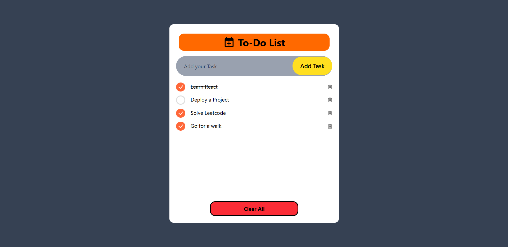

# 📝 To-Do List App

A clean, minimal, and efficient task management app built with **React**, **Tailwind CSS**, and **Vite** to help you organize your day and boost productivity.

---

## 🚀 Features

- ✅ Add, edit, and delete tasks
- 📌 Mark tasks as completed
- 💾 Persistent data with local storage
- 🎨 Responsive UI powered by Tailwind CSS
- ⚡ Blazing fast development with Vite

---

## 🛠 Tech Stack

- **React** – JavaScript library for building UIs
- **Tailwind CSS** – Utility-first CSS framework
- **Vite** – Next-gen frontend tooling
- **JavaScript (ES6+)** – Clean, modern syntax

---

## 📦 Installation

```bash
git clone https://github.com/SHUBHAM2775/To-Do-List.git
cd To-Do-List
npm install
npm run dev
Then open your browser at http://localhost:3000

```

## 📸 Screenshots




